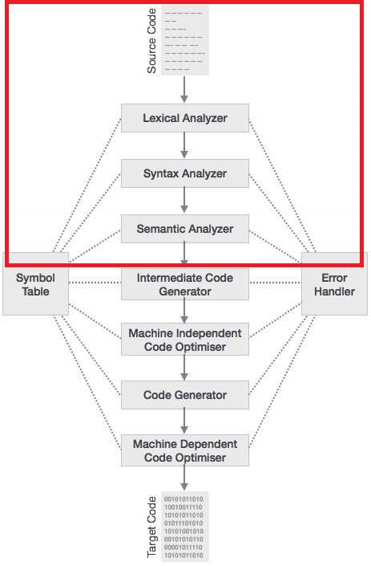
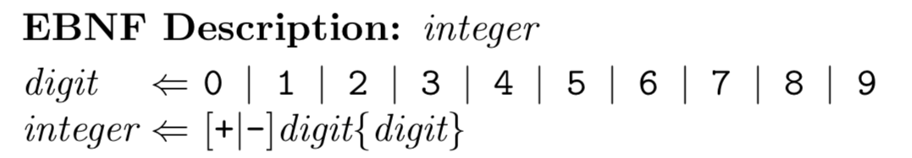

# Writing your own first interpreter

rpw@touk.pl

---


---
### Compilation Phases

---


+++


---
### terminology
token = object describing a lexeme  
lexeme = uniquely identifiable sequence of characters like:  
keywords ("if", "while" etc), identifiers, strings...

---
### So you want to write your first interpreter?

---
### Lets start with the language

---
### EBNF - Language to define language 


---
### Problems with grammar

---
### Left-side recursion

---
### Left-side factorisation

---
### "FileScript"

+++
```
program = { instruction ';'}

instruction = definition | functionCall | assignment | if | foreach 

definition = variableDefinition | functionDefinition

variableDefinition = identifier ':' (arrayDefinition | fileDefinition | primitiveOrDateDefinition) 

identifier = name {['[' constInt ']'] '.' name}
name = alpha { alpha | digit }
alpha = 'a' | 'b' | ... | 'Z' | '_' 
digit = '0' | '1' | '2' | '3' | '4' | '5' | '6' | '7' | '8' | '9'

arrayDefinition = '[' [constInt] ']' type assignmentOperator (constArray | identifier)
constInt = digit { digit } 

type = fileType | dateType | simpleType
fileType = "file" | "catalogue" 
dateType = "date"
simpleType = "int" | "string" | "bool" 

assignmentOperator = '='

constArray = '[' { constValue { ',' constValue } ']'

constValue = constInt | constString | constDate | constBool
constString = '"' { alpha | digit } '"'
constBool = "true" | "false"
constDate = DD '/' MM '/' YYYY [':' hour ':' minute ':' second]
DD = MM = hour = minute = second = digit digit
YYYY = digit digit digit digit

fileDefinition = fileType assignmentOperator '{' attribute { attribute } '}' 
attribute = identifier ':' (constValue | identifier)

primitiveOrDateDefinition = (simpleType | dateType) assignmentOperator (constValue | identifier)

functionDefinition = "def" identifier '(' argumentsWithTypes ')' assignmentOperator instructionBlock
argumentsWithTypes = { identifier ':' type [ ',' identifier ':' type ] }

instructionBlock = '{' { instruction ';' [ instruction ';' ] } '}'
 
functionCall = identifier '(' arguments ')' 
arguments = { identifier [',' identifier ] }

assignment = identifier assignmentOperator assignableExpression

assignableExpression = expression

expression = expression logicalOperator | T
T = T relationalOperator T2 | T2
T2 = T2 lowPriorityArithmeticOperator T3 | T3
T3 = T3 highPriorityArithmeticOperator operand | operand
operand = identifier | constValue | functionCall | constArray

relationalOperator = "==" | "<=" | ">=" | '>' | '<' 
lowPriorityArithmeticOperator = '+' | '-'  
highPriorityArithmeticOperator = '/' | '*'
logicalOperator = "and" | "or" 

if = "if" '('expression')' instructionBlock ["else" instructionBlock]

foreach = "foreach" '('identifier ":" identifier')' instructionBlock
```

---

### Source
Chars not Strings  
No buffers needed  
Errors - fatal

---
### Lexer
Changes chars into tokens  
But what is a good token candidate?  

+++
```
program = { instruction ';'}

instruction = definition | functionCall | assignment | if | foreach 

definition = variableDefinition | functionDefinition

variableDefinition = identifier ':' (arrayDefinition | fileDefinition | primitiveOrDateDefinition) 

identifier = name {['[' constInt ']'] '.' name}
name = alpha { alpha | digit }
alpha = 'a' | 'b' | ... | 'Z' | '_' 
digit = '0' | '1' | '2' | '3' | '4' | '5' | '6' | '7' | '8' | '9'

arrayDefinition = '[' [constInt] ']' type assignmentOperator (constArray | identifier)
constInt = digit { digit } 

type = fileType | dateType | simpleType
fileType = "file" | "catalogue" 
dateType = "date"
simpleType = "int" | "string" | "bool" 

assignmentOperator = '='

constArray = '[' { constValue { ',' constValue } ']'

constValue = constInt | constString | constDate | constBool
constString = '"' { alpha | digit } '"'
constBool = "true" | "false"
constDate = DD '/' MM '/' YYYY [':' hour ':' minute ':' second]
DD = MM = hour = minute = second = digit digit
YYYY = digit digit digit digit

fileDefinition = fileType assignmentOperator '{' attribute { attribute } '}' 
attribute = identifier ':' (constValue | identifier)

primitiveOrDateDefinition = (simpleType | dateType) assignmentOperator (constValue | identifier)

functionDefinition = "def" identifier '(' argumentsWithTypes ')' assignmentOperator instructionBlock
argumentsWithTypes = { identifier ':' type [ ',' identifier ':' type ] }

instructionBlock = '{' { instruction ';' [ instruction ';' ] } '}'
 
functionCall = identifier '(' arguments ')' 
arguments = { identifier [',' identifier ] }

assignment = identifier assignmentOperator assignableExpression

assignableExpression = expression

expression = expression logicalOperator | T
T = T relationalOperator T2 | T2
T2 = T2 lowPriorityArithmeticOperator T3 | T3
T3 = T3 highPriorityArithmeticOperator operand | operand
operand = identifier | constValue | functionCall | constArray

relationalOperator = "==" | "<=" | ">=" | '>' | '<' 
lowPriorityArithmeticOperator = '+' | '-'  
highPriorityArithmeticOperator = '/' | '*'
logicalOperator = "and" | "or" 

if = "if" '('expression')' instructionBlock ["else" instructionBlock]

foreach = "foreach" '('identifier ":" identifier')' instructionBlock
```

+++?code=src/main/java/lexer/token/TokenType.java&lang=java